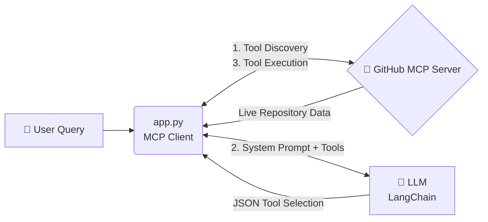

<div align="center">

# 🚀 GitHub MCP Agent Integration

**Next-Generation LLM Orchestration with Model Context Protocol**

[]()
[]()
[]()

_A real-world demonstration of connecting an AI agent to GitHub's official remote MCP server for dynamic tool discovery and execution._

</div>

---

## 🌟 Overview

This project acts as an **MCP Host/Client** that securely connects to GitHub's remote server. By combining the standardized **Model Context Protocol** with a **Large Language Model (LLM)**, this agent can dynamically:

1. **Discover** available tools directly from GitHub in real-time.
2. **Reason** about a user's natural language request.
3. **Execute** the exact right repository operations (like querying pull requests) autonomously.

## 🏗️ Architecture



## ⚙️ Prerequisites

- 🐍 **Python 3.10** or higher
- 🔑 **GitHub Personal Access Token (PAT)** _(Requires repository read permissions)_
- 🧠 **LLM API Key** _(OpenAI or an OpenAI-compatible provider)_

## 🚀 Quick Start

### 1. Clone & Setup

```bash
# Create a virtual environment
python -m venv venv

# Activate the environment
# On Windows use: venv\Scripts\activate
source venv/bin/activate

# Install core dependencies
pip install mcp langchain-openai httpx python-dotenv
```

### 2. Configuration

Create a `.env` file in the root directory. This keeps your credentials secure and out of version control.

```env
# GitHub Configuration
GITHUB_PERSONAL_ACCESS_TOKEN=your_github_pat_here

# LLM Configuration
LLM_API_KEY=your_llm_api_key_here
LLM_BASE_URL=[https://api.your-llm-provider.com/v1](https://api.your-llm-provider.com/v1)
LLM_MODEL=gpt-5.6-luna
```

### 3. Execution

Fire up the intelligent agent:

```bash
python app.py
```

<details>
<summary>👀 <b>Click to see the expected terminal output</b></summary>
<br>

```text
✅ Handshake complete! Server returned 15 tools.

💬 User query: 'Please check the repository langchain-ai/langchain and tell me the title and author of the last raised pull request.'

🎯 LLM's decision: {"tool": "get_pull_requests", "args": {"repo": "langchain-ai/langchain", "limit": 1}}

🚀 Running the 'get_pull_requests' tool on the server...

📦 Live result from GitHub:
[Pull Request details stream here...]
```

</details>

## 🧠 Under the Hood: How it Works

| Step            | Component                | Description                                                                                   |
| :-------------- | :----------------------- | :-------------------------------------------------------------------------------------------- |
| **1. Auth**     | `httpx`                  | Initializes an async HTTP client injected with your GitHub PAT for secure authorization.      |
| **2. Connect**  | `streamable_http_client` | Opens a streamable connection to GitHub's MCP endpoint (`api.githubcopilot.com/mcp`).         |
| **3. Discover** | `session.list_tools()`   | Dynamically fetches the server's capabilities. **No hardcoded tool schemas!**                 |
| **4. Reason**   | `LangChain`              | Formats the discovered tools into a system prompt, instructing the LLM to return strict JSON. |
| **5. Execute**  | `session.call_tool()`    | Parses the LLM's decision and routes it back to GitHub to fetch the real-world data.          |

---

<div align="center">
<i>Built with ❤️ using the Model Context Protocol</i>
</div>
